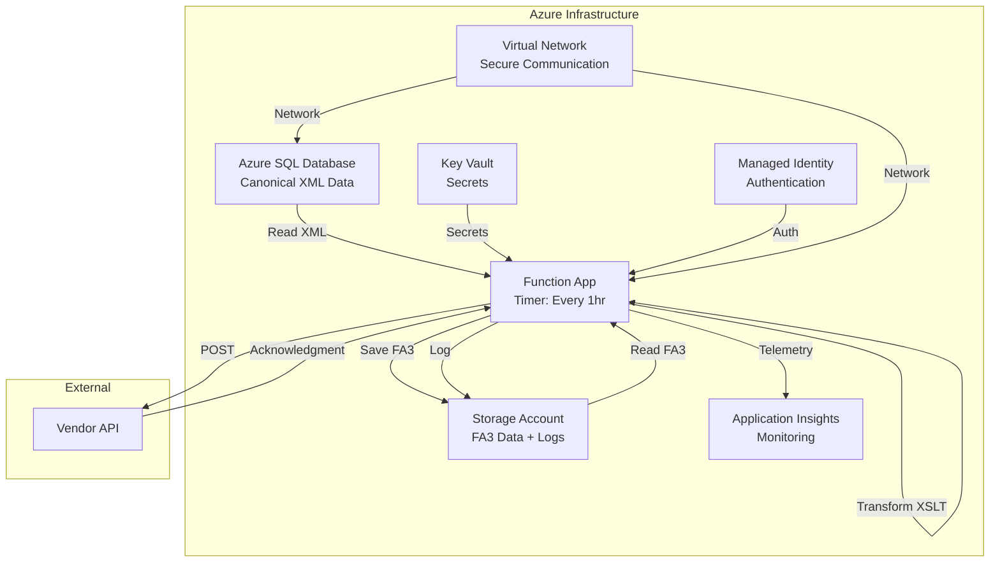

# Azure XML to FA(3) Integration Infrastructure

Complete Terraform configuration for Azure infrastructure that processes XML data from Azure SQL Database, transforms it to FA(3) standard format using XSLT, and sends it to vendor APIs.

## Architecture Overview



## Features

- ✅ **Automated Processing**: Timer-triggered Function App runs every hour
- ✅ **Secure**: Managed Identity, Key Vault for secrets, VNet integration
- ✅ **Scalable**: Azure Functions consumption plan
- ✅ **Monitored**: Application Insights for logging and telemetry
- ✅ **Reliable**: Blob storage for FA(3) data persistence and acknowledgments
- ✅ **Infrastructure as Code**: Complete Terraform configuration using Azure Verified Modules

## Prerequisites

- Azure subscription with appropriate permissions
- Terraform >= 1.6.0
- Git (for downloading Azure Verified Modules)
- Azure CLI (optional, for authentication)
- Python 3.11+ (for Function App development)

## Project Structure

```
azure-xml-integration/
├── terraform/              # Terraform configuration
│   ├── main.tf            # Main infrastructure resources
│   ├── variables.tf       # Input variables
│   ├── outputs.tf         # Output values
│   ├── providers.tf       # Provider configuration
│   └── locals.tf          # Local values
├── function-app/          # Azure Function App code
│   ├── host.json          # Function host configuration
│   ├── requirements.txt   # Python dependencies
│   └── XmlProcessor/      # Timer-triggered function
│       ├── __init__.py    # Main function code
│       ├── function.json  # Function bindings
│       └── transform.xslt # XSLT transformation template
├── scripts/               # Utility scripts
│   └── download-modules.sh # Download Azure Verified Modules
└── modules/               # Local Azure Verified Modules (created by script)
```

## Quick Start

### 1. Download Azure Verified Modules

```bash
cd azure-xml-integration
./scripts/download-modules.sh
```

This script downloads all required Azure Verified Modules to the `modules/` directory.

### 2. Configure Variables

Create a `terraform.tfvars` file in the `terraform/` directory:

```hcl
# terraform/terraform.tfvars

location     = "eastus"
environment  = "dev"
project_name = "xmlintegration"

# SQL Database
sql_admin_username = "sqladmin"
sql_admin_password = "YourSecurePassword123!"  # Use strong password
sql_database_name  = "XmlDataDB"
sql_table_name     = "CanonicalXmlData"
sql_sku_name       = "S0"

# Function App
function_timer_schedule = "0 0 * * * *"  # Every hour

# Vendor API
vendor_api_url       = "https://vendor-api.example.com/fa3/submit"
vendor_api_auth_type = "apikey"
vendor_api_key       = "your-vendor-api-key"

# Tags
tags = {
  ManagedBy   = "Terraform"
  Project     = "XML-FA3-Integration"
  Environment = "Development"
  CostCenter  = "IT"
}
```

> **⚠️ Security Warning**: Never commit `terraform.tfvars` with sensitive data to version control. Add it to `.gitignore`.

### 3. Initialize Terraform

```bash
cd terraform
terraform init
```

### 4. Review Plan

```bash
terraform plan
```

Review the execution plan to ensure all resources are configured correctly.

### 5. Deploy Infrastructure

```bash
terraform apply
```

Type `yes` when prompted to confirm deployment.

### 6. Deploy Function App Code

After infrastructure is deployed, deploy the Function App code:

```bash
# Get Function App name from Terraform output
FUNCTION_APP_NAME=$(terraform output -raw function_app_name)

# Deploy using Azure Functions Core Tools
cd ../function-app
func azure functionapp publish $FUNCTION_APP_NAME
```

Alternatively, use Azure DevOps, GitHub Actions, or Azure Portal for deployment.

## Configuration

### SQL Database Schema

Your SQL Database table should have the following schema (adjust as needed):

```sql
CREATE TABLE CanonicalXmlData (
    id INT PRIMARY KEY IDENTITY(1,1),
    xml_data NVARCHAR(MAX) NOT NULL,
    created_at DATETIME2 DEFAULT GETUTCDATE(),
    processed BIT DEFAULT 0,
    processed_at DATETIME2 NULL
);
```

### XSLT Transformation

Customize the XSLT transformation template at `function-app/XmlProcessor/transform.xslt` based on:

1. Your canonical XML schema
2. FA(3) standard format specification
3. Your specific field mapping requirements

The provided template is a placeholder and must be customized for your use case.

### Timer Schedule

The timer schedule uses NCRONTAB expression format:

- `0 0 * * * *` - Every hour (default)
- `0 */30 * * * *` - Every 30 minutes
- `0 0 */2 * * *` - Every 2 hours
- `0 0 9 * * *` - Every day at 9:00 AM

Update the `function_timer_schedule` variable in `terraform.tfvars`.

## Monitoring

### Application Insights

View logs and telemetry in Azure Portal:

1. Navigate to Application Insights resource
2. Go to "Logs" or "Transaction search"
3. Query function execution logs

Example query:

```kusto
traces
| where operation_Name == "XmlProcessor"
| order by timestamp desc
| take 100
```

### Function App Logs

View real-time logs:

```bash
func azure functionapp logstream $FUNCTION_APP_NAME
```

## Outputs

After deployment, Terraform provides the following outputs:

```bash
# View all outputs
terraform output

# View specific output
terraform output function_app_name
terraform output sql_server_fqdn
terraform output storage_account_name
```

## Security Best Practices

1. **Secrets Management**: All sensitive data stored in Azure Key Vault
2. **Managed Identity**: Function App uses Managed Identity for authentication
3. **Network Security**: VNet integration for secure communication
4. **RBAC**: Least privilege access using Azure role assignments
5. **Encryption**: Data encrypted at rest and in transit

## Troubleshooting

### Function Not Triggering

1. Check timer schedule configuration
2. Verify Function App is running
3. Check Application Insights for errors

### SQL Connection Errors

1. Verify firewall rules allow Azure services
2. Check connection string in Key Vault
3. Ensure Managed Identity has SQL permissions

### XSLT Transformation Errors

1. Validate XML input format
2. Test XSLT transformation locally
3. Check Function App logs for detailed errors

### Vendor API Errors

1. Verify API endpoint URL
2. Check API authentication credentials
3. Review API response in logs

## Cost Optimization

- **Function App**: Consumption plan (pay per execution)
- **SQL Database**: Use appropriate SKU (S0 for dev, scale for prod)
- **Storage**: LRS replication for dev, GRS for prod
- **Application Insights**: Configure sampling to reduce costs

## Cleanup

To destroy all resources:

```bash
cd terraform
terraform destroy
```

Type `yes` when prompted to confirm deletion.

## Module References

This project uses the following Azure Verified Modules:

- [avm-res-resources-resourcegroup](https://github.com/Azure/terraform-azurerm-avm-res-resources-resourcegroup)
- [avm-res-managedidentity-userassignedidentity](https://github.com/Azure/terraform-azurerm-avm-res-managedidentity-userassignedidentity)
- [avm-res-network-virtualnetwork](https://github.com/Azure/terraform-azurerm-avm-res-network-virtualnetwork)
- [avm-res-storage-storageaccount](https://github.com/Azure/terraform-azurerm-avm-res-storage-storageaccount)
- [avm-res-keyvault-vault](https://github.com/Azure/terraform-azurerm-avm-res-keyvault-vault)
- [avm-res-insights-component](https://github.com/Azure/terraform-azurerm-avm-res-insights-component)
- [avm-res-sql-server](https://github.com/Azure/terraform-azurerm-avm-res-sql-server)
- [avm-res-web-serverfarm](https://github.com/Azure/terraform-azurerm-avm-res-web-serverfarm)
- [avm-res-web-site](https://github.com/Azure/terraform-azurerm-avm-res-web-site)

## Support

For issues or questions:

1. Check Azure Function App logs in Application Insights
2. Review Terraform plan output
3. Consult Azure Verified Modules documentation

## License

This project is provided as-is for demonstration purposes.
